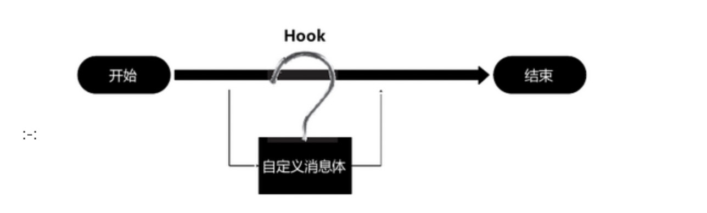

[程序猿口中的Hook是什么意思？](https://www.jianshu.com/p/0eeb3885b2e1)

[什么是hook技术](https://www.kancloud.cn/alex_wsc/android/506821)

# Hook是什么意思？

翻译了一下是`钩子`的意思

其实钩子来源于英文词Hook，在windows系统中，一切皆消息，比如按了一下键盘，也是一个消息，
`Hook的意思是勾住，也就是在消息过去之前，可以先把消息勾住，不让其传递，
你可以优先处理，`也即这项技术就是提供了一个入口，能够针对不同的消息或者API在执行前，
先执行你的操作，你的操作也称为「钩子函数」
所以，有的时候程序员在讨论的时候，也经常会说，可以先hook住，在处理，也即在执行某某操作之前，优先处理一下
好啦，这就是Hook的思想和原理

## 什么是Hook 技术
Hook是“钩子”的意思，在Android 操作系统中系统维护着自己的一套事件分发机制。
应用程序，包括应用触发事件和后台逻辑处理，也是根据事件流程一步步地向下执行。
而“钩子”的意思，就是`在事件传送到终点前截获井监控事件的传输`，
像个钩子钩上事件一样，并且能够在钩上事件时，处理一些自己特定的事件。较为形象的流程如下图所示。

 

Hook 的这个本领，使它能够将自身的代码“融入”被勾住（ Hook ）的程序的进程中，成为目标进程的一个部分。
在Android 系统中使用了沙箱机制，普通用户程序的进程空间都是独立的，程序的运行彼此间都不受干扰。
根据Hook 对象与Hook 后处理的事件方式不同， Hook 还分为不同的种类，如消息Hook 、APIHook 等。

## Hook 原理
Hook技术无论对安全软件还是恶意软件都是十分关键的一项技术，其本质就是`劫持函数调用`。
但是由于处于Linux 用户态，每个进程都有自己独立的进程空间，
所以必须先注入到所要Hook 的进程空间，修改其内存中的进程代码，替换其过程表的符号地址。
在Android 中一般是通过ptrace函数附加进程，然后向远程进程注人so 库，
从而达到监控以及远程进程关键函数挂钩。

 
